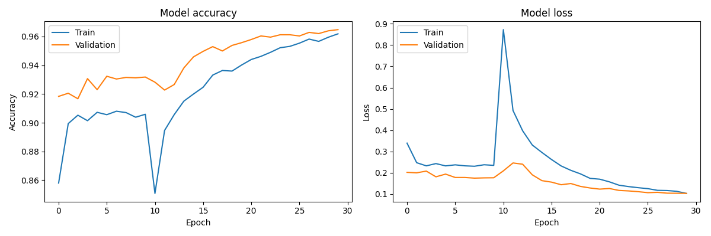
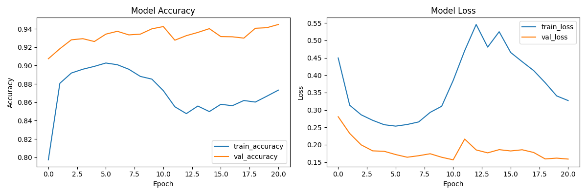
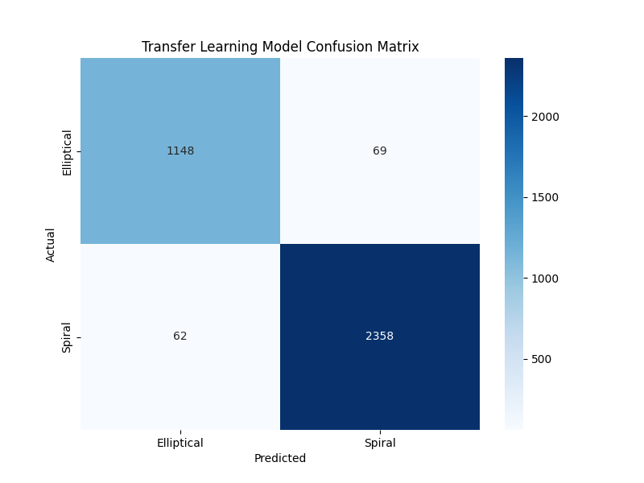
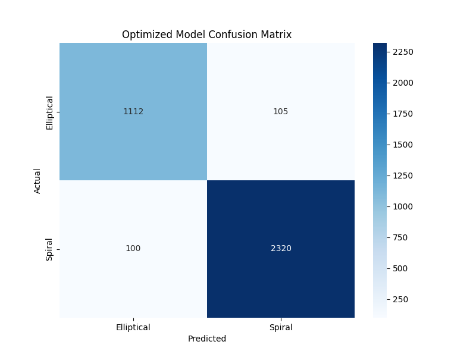
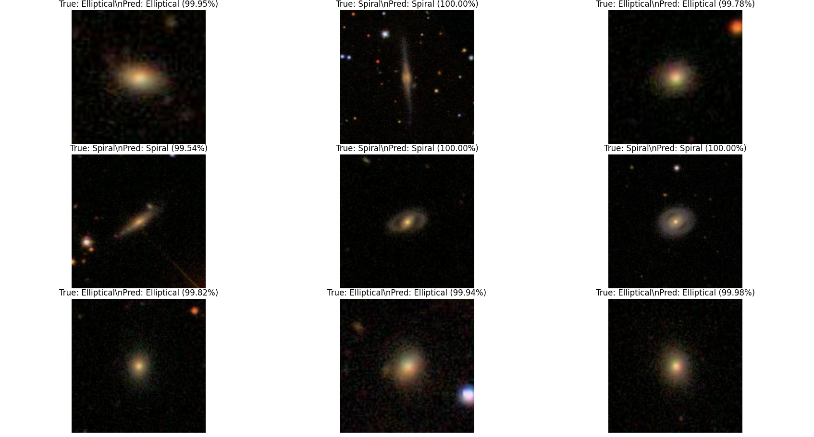

# Cosmic Classifier: A Deep Learning Project for Galaxy Morphology


A project to develop and train a Convolutional Neural Network (CNN) to classify galaxy images into two primary morphological types: **Elliptical** and **Spiral**. The project builds and evaluates three models: a custom-built CNN, a transfer learning model using MobileNetV2, and an optimized CNN tuned with KerasTuner and trained with advanced data augmentation.

The key finding is that the original, custom-built baseline model **achieved 98% accuracy**, outperforming both the transfer learning and the hyperparameter-tuned approaches.

---

## Table of Contents
- [Project Goal](#project-goal)
- [Dataset](#dataset)
- [Methodology](#methodology)
- [Results](#results)
- [Project Structure](#project-structure)
- [Getting Started](#getting-started)
- [Usage](#usage)

---

## Project Goal
The objective was to follow a structured deep learning workflow to build an accurate galaxy classifier. This involved comparing a simple, custom-built CNN against a more complex, pre-trained transfer learning model to determine the most effective approach for this specific domain.

---

## Dataset
- **Source**: [Galaxy Zoo 2 Challenge (Kaggle)](https://www.kaggle.com/c/galaxy-zoo-the-galaxy-challenge)
- **Images**: `images_training_rev1.zip`
- **Labels**: `training_solutions_rev1.csv`

The dataset consists of 61,578 galaxy images, with labels derived from weighted votes by human classifiers.

---

## Methodology

### 1. Data Preprocessing (`preprocess.py`)
- **Filtering**: The dataset was filtered to include only high-confidence samples where the vote for either 'Elliptical' or 'Spiral' was > 80%. The 'Artifact' class was removed due to a severe class imbalance (only 2 samples). This resulted in a high-quality dataset of 24,245 images.
- **Data Splitting**: The data was split into training (70%), validation (15%), and testing (15%) sets using stratification.
- **Pipeline**: A `tf.data.Dataset` pipeline was created for efficient training, which handled:
    - Image loading and resizing (128x128 pixels).
    - Pixel normalization to a [0, 1] range.
    - Basic data augmentation on the training set (random vertical flips and rotations).

### 2. Baseline CNN Model (`scripts/train_baseline.py`)
A simple, custom CNN was built from scratch. Its architecture consists of three convolutional blocks (Conv2D + MaxPooling2D) followed by a dense head with dropout for regularization.

### 3. Transfer Learning Model (`scripts/train_transfer_learning.py`)
- **Base Model**: `MobileNetV2`, pre-trained on ImageNet, was used as the feature extraction base. Its layers were initially frozen.
- **Custom Head**: A custom classification head (GlobalAveragePooling2D, Dropout, Dense) was added on top of the base.
- **Two-Stage Training**:
    1.  **Feature Extraction**: Only the custom head was trained for 10 epochs.
    2.  **Fine-Tuning**: The top layers of the MobileNetV2 base were unfrozen and the entire model was trained for another 20 epochs with a very low learning rate (1e-5).

### 4. Optimized Model (`advanced/`)
To explore the upper limits of performance, a third model was developed:
- **Hyperparameter Tuning (`advanced/tune_and_augment.py`)**: KerasTuner was used to search for the optimal combination of filters, dense units, dropout rate, and learning rate.
- **Advanced Augmentation**: The `albumentations` library was used to apply more diverse augmentations (brightness/contrast changes, noise, flips, rotations).
- **Final Training (`advanced/train_optimized_model.py`)**: The best hyperparameters found by the tuner were used to train a new model from scratch with the advanced augmentation pipeline.

---

## Results

The final models were evaluated on the held-out test set.

| Model                       | Test Accuracy |
| --------------------------- | ------------- |
| **Baseline CNN**            | **98%**       |
| Transfer Learning (MobileNetV2) | 96%           |
| Optimized & Augmented CNN   | 94%           |

**Conclusion**: The simplest, custom-built baseline model significantly outperformed the more complex approaches. This is a crucial finding, highlighting that for a specialized and high-quality dataset like this one, a tailored architecture can learn more relevant features than a general-purpose, pre-trained model. Furthermore, the addition of hyperparameter tuning and more complex augmentations did not yield better performance, suggesting the baseline model was already a highly effective and efficient solution for this specific task.

### Model Performance Visualizations

*(These plots were generated by the training and evaluation scripts)*

| Baseline History | Transfer Learning History | Optimized History |
| :---: | :---: | :---: |
|  |  |  |

| Baseline CM | Transfer Learning CM | Optimized CM |
| :---: | :---: | :---: |
|  |  |  |

### Qualitative Results (Baseline Model)

Here are some example predictions from our best-performing model (the baseline CNN) on the test set.



---

## Project Structure

```
.
├── advanced/
│   ├── tune_and_augment.py
│   └── train_optimized_model.py
├── assets/
│   ├── banner.jpg
│   └── ... (plots)
├── data/
│   └── ... (Kaggle data)
├── models/
│   ├── baseline_model.keras
│   ├── transfer_model.keras
│   └── optimized_galaxy_model.keras
├── scripts/
│   ├── eda.py
│   ├── preprocess.py
│   └── ... (all other .py files)
├── .gitignore
└── README.md
```

---

## Getting Started

### Prerequisites
- Python 3.8+
- An environment with the packages listed in `requirements.txt`.

### Installation
1.  **Clone the repository:**
    ```bash
    git clone <your-repo-url>
    cd <your-repo-name>
    ```
2.  **Install dependencies:**
    ```bash
    pip install -r requirements.txt
    ```
3.  **Download the data** from the [Kaggle competition page](https://www.kaggle.com/c/galaxy-zoo-the-galaxy-challenge) and place the `images_training_rev1` folder and `training_solutions_rev1.csv` file into the `data/galaxy-zoo-the-galaxy-challenge/` directory.

---

## Usage

The Python scripts are designed to be run in sequence from the root of the `Cosmic-Classifier` directory.

1.  **Exploratory Data Analysis & Visualization**:
    ```bash
    python scripts/eda.py
    python scripts/visualize_data.py
    ```
2.  **Train Baseline & Transfer Learning Models**:
    ```bash
    python scripts/train_baseline.py
    python scripts/train_transfer_learning.py
    ```
3.  **Run Advanced Model Experiment**:
    This first script runs the hyperparameter search.
    ```bash
    python advanced/tune_and_augment.py
    ```
    This second script trains the final optimized model using the best parameters.
    ```bash
    python advanced/train_optimized_model.py
    ```
4.  **Evaluate All Models**:
    This generates the final classification reports and confusion matrices for all three models.
    ```bash
    python scripts/evaluate_models.py
    ```
5.  **Qualitative Evaluation**:
    View predictions on random test images from the best model (the baseline).
    ```bash
    python scripts/qualitative_evaluation.py
    ```
